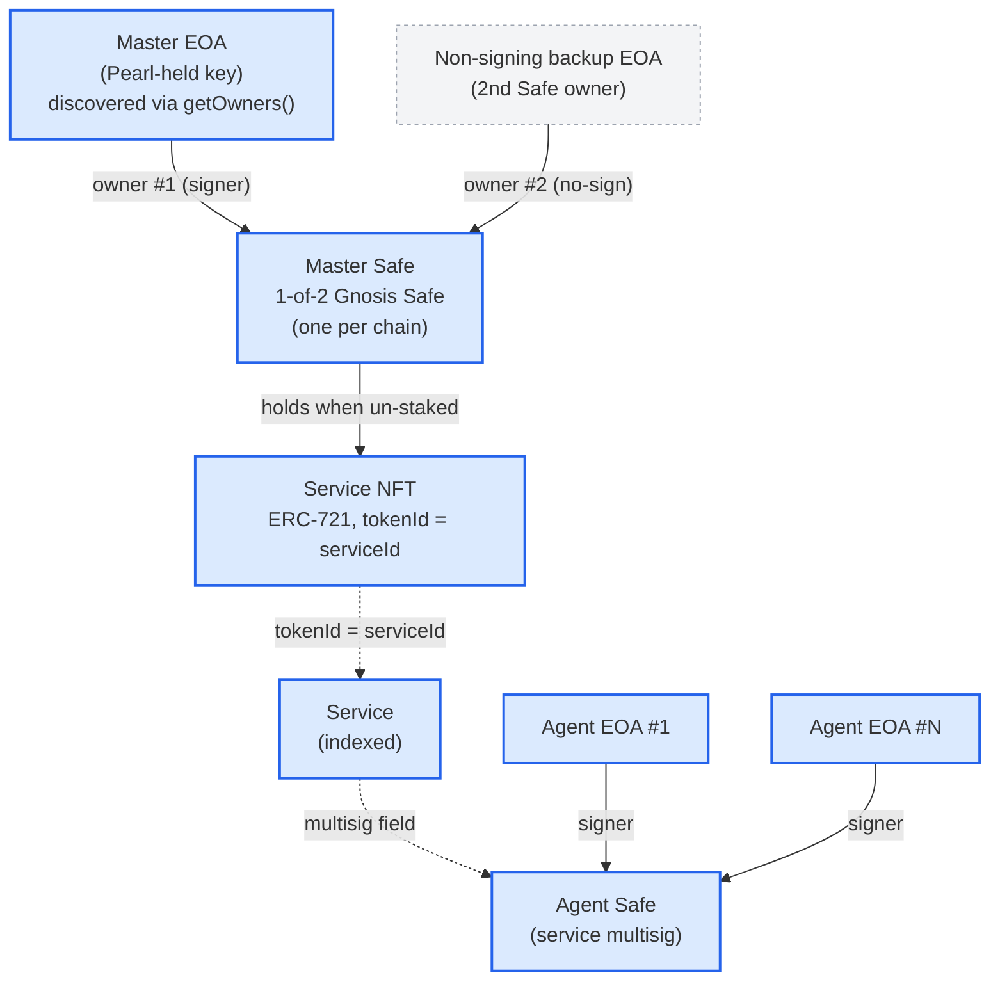
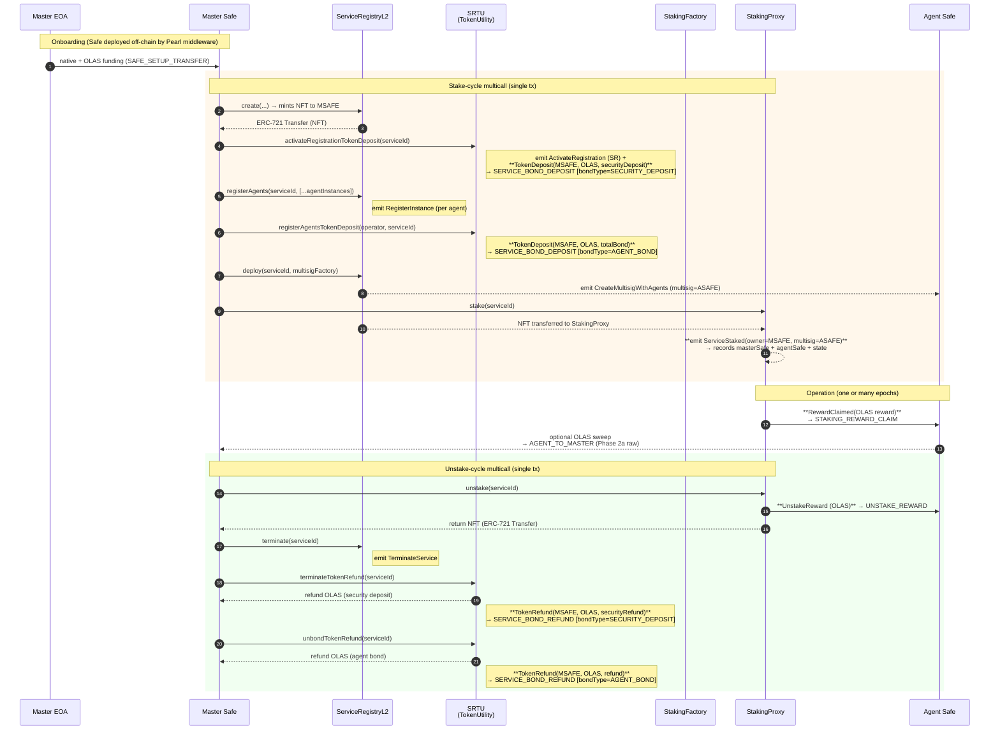
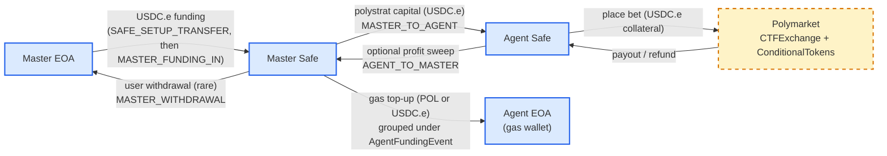

# Pearl Funds-Movement Subgraph — Implementation Plan

**Status:** Proposed — for verification before implementation. No code yet.
**Proposed subgraph:** `subgraphs/pearl-funds/` (final name TBD — see §11 #5)
**Target networks (v1):** Gnosis, Polygon, Optimism, Base
**Last updated:** 2026-05-27 (Rev. 4 addresses both @Tanya-atatakai's and @rajat2502's PR #130 design-review comments: wrapped-native ERC-20 data sources promoted from metadata-only to Phase 2a, OPENING_BALANCE + historyFloor anchor concept for pre-discovery UX, USDC.e §6.3 framing tightened with the consumer-side merge-cost trade-off, multi-token tx aggregation flagged as Rev. 5 open question, native EOA pre-creation reframed as explicit product-decision Open Q; Rev. 3 added §4.5 per-network asset inventory and §4.6 Mermaid funds-flow diagrams; Rev. 2 added SRTU bond-event indexing, agent-ID anti-hardcoding confirmation, and Master EOA pre-creation tracking; Rev. 1 addressed PR #129 review feedback from @Tanya-atatakai and @rajat2502)

This document scopes a new subgraph that indexes **funds movement for the
Master Safe and Agent Safe of Pearl predict services**. It covers Phase 1
(semantic ledger), Phase 2 (raw token ledger), the full asset/file
inventory, the reuse map, and the implementation sequence.

It is the dedicated funding subgraph explicitly deferred by the prior Pearl
scoping work — see [`subgraphs/pearl/SUBGRAPH_PLAN.md`](../pearl/SUBGRAPH_PLAN.md)
§6.1: *"If this later needs to ship on-chain … a dedicated funding subgraph
is the right place — not mixed into trades."* That branch
(`docs/pearl-subgraph-plan`) generalized **trade** tracking in
`predict-polymarket`; this plan is the orthogonal, complementary
**funding** work it called out.

---

## 1. Background & Motivation

### 1.1 The actors in a Pearl service

| Actor | What it is | On-chain derivation |
|---|---|---|
| **Master EOA** | The key Pearl holds for the user. Primary signer on the Master Safe. | `GnosisSafe.getOwners()[0]` on each Master Safe — one-shot eth_call at first sighting; kept current via `Safe.AddedOwner` / `RemovedOwner` template events (Phase 2a). |
| **Master Safe** | A Gnosis Safe owned by the Master EOA. **1-of-2** (threshold = 1, two owners — the Master EOA plus a non-signing backup); see `olas-operate-middleware/operate/utils/gnosis.py:177-182`. One per chain. Funds and owns services; **holds the service NFT**. | `StakingProxy.ServiceStaked.owner` + ERC-721 `Transfer` owner of the service NFT (cross-checked). |
| **Service** | An Olas service, an ERC-721 minted by `ServiceRegistryL2`. `tokenId == serviceId`. Owned by the Master Safe. | All services on `ServiceRegistryL2` — see §2.3. |
| **Agent Safe** | The service multisig (`ServiceRegistryL2.CreateMultisigWithAgents.multisig`). The Safe the agent operates from — places bets, receives rewards. | `CreateMultisigWithAgents.multisig`. |
| **Agent EOA(s)** | Agent instances registered via `RegisterInstance`; signers of the Agent Safe. | `RegisterInstance.{agentInstance, operator}`, deduplicated per service. |
| **Staking proxy** | A `StakingToken`/`StakingProxy` instance created by `StakingFactory`. Custodies the service NFT while staked; pays OLAS rewards. | `StakingFactory.InstanceCreated` → `StakingProxy` template. |

The funding hierarchy: **Master EOA → Master Safe → Agent Safe → app
contracts (staking, prediction markets) → back.** All four wallet types
are derived from on-chain data; no off-chain mapping or import.

### 1.2 The fund flows to capture

1. **Stake.** The service NFT moves Master Safe → staking proxy.
   `StakingProxy.ServiceStaked` carries both `owner` (Master Safe) and
   `multisig` (Agent Safe).
2. **Claim.** `StakingProxy.RewardClaimed` — OLAS is transferred to the
   Agent Safe. The amount is in the event.
3. **Unstake.** `ServiceUnstaked` / `ServiceForceUnstaked` — remaining
   rewards go to the Agent Safe; the service NFT moves staking proxy →
   Master Safe.
4. **Reward sweep.** Claimed OLAS is sometimes moved Agent Safe → Master
   Safe afterward. This is a discretionary transfer, not covered by any
   staking event.
5. **App funding.** Native coin / USDC / USDC.e(pUSD) moves Master Safe →
   app-specific contracts and is received back by the Master/Agent Safe as
   prediction proceeds (omenstrat on Gnosis, polystrat on Polygon).

### 1.3 The gap this fills

| Existing subgraph | Covers | Does **not** cover |
|---|---|---|
| `predict/predict-omen`, `predict/predict-polymarket` | Per-Agent-Safe bet / fee / payout P&L *inside* prediction markets | Master Safe; raw funding; staking |
| `staking` | Service staking aggregates, reward totals per service per epoch | Master/Agent Safe as funding entities; literal token transfers |
| `service-registry` | Service lifecycle, multisig, ERC-8004 identity | Master Safe (its `creator` field is `tx.from`, an EOA/relayer — not the Safe); funds; staking |

**Nothing models the Master Safe, or the flows between Master Safe ↔ Agent
Safe ↔ staking ↔ app contracts as a single ledger.** That is precisely the
scope here. In-market bet P&L stays owned by the predict subgraphs;
consumers join on the Agent Safe address.

---

## 2. Hard Constraints

### 2.1 On-chain data only — no server-side joins (inherited)

Inherited verbatim from [`pearl/SUBGRAPH_PLAN.md`](../pearl/SUBGRAPH_PLAN.md)
§1.1. The subgraph indexes **only on-chain data**, and on-chain data may
only be joined with **other on-chain data**. Funds movement is public
ERC-20 / native / NFT transfer data — public-with-public, fully in bounds.

What must **never** appear: any field or identifier that correlates an
on-chain transfer to the prediction server's private request log
(`mode`, `tool`, `tier`, request id, cost, session id, time-window join
keys). §12 ("Deliberately Absent") enforces this at schema-review time.

### 2.2 Indexing-cost discipline

A naive "index every USDC.e `Transfer` on Polygon" subgraph is
prohibitively expensive — Polygon USDC.e is one of the highest-volume
ERC-20s in the ecosystem, and graph-node must decode and dispatch **every**
`Transfer` of a token data source even when the handler early-returns.
This is the same objection the prior plan raised (§6.1) when it deferred
funding indexing. The phasing in §3.2 and the benchmark gate in §6.3 exist
specifically to manage this.

### 2.3 Cohort keying — query-time, not index-time

All per-service analytics key on the Olas `serviceId` and, transitively,
the Master Safe / Agent Safe addresses. Pearl-specific cohorts (predict
on Gnosis = agent ID 25, polystrat on Polygon = agent ID 86, Pearl-Mini
operator filter, etc.) are recorded **on each `Service` as data fields**
(`agentIds: [Int!]!`, `operators: [Bytes!]!`) and filtered **by
consumers at query time** — not hard-coded in the WASM as an indexing
gate.

Rationale (corrected from earlier revision per @Tanya-atatakai PR #129
review):

- A WASM-level agent-ID gate would force a **full reindex every time a
  new Pearl agent type launches** — the constant list lives in the
  compiled mapping, so any change requires redeploy + resync. This is
  exactly the kind of brittleness the trade subgraph plan avoided.
- The indexing-cost concern in §2.2 is bounded by the size of
  `TrackedSafe` in Phase 2, **not** by the total number of indexed
  services. `ServiceRegistryL2` event volume is low (same shape as the
  `service-registry` subgraph), so indexing every service is cheap.
- Recording `agentIds` + `operators` on each `Service` preserves every
  cohort filter the prior plan called out (predict ID, polystrat ID,
  PolySafeCreator `0xA749f605D93B3efcc207C54270d83C6E8fa70fF8` for
  Pearl-Mini vs. polystrat split) — applied client-side, no reindex on
  new IDs.

Known Pearl predict agent IDs for documentation (the WASM does **not**
filter on these — they're consumer query parameters):

| Network | Pearl predict agent ID | Source |
|---|---|---|
| Gnosis (omenstrat) | **25** | Confirmed by maintainer; matches `valory-xyz/autonolas-subgraph` PR #89 (`PREDICT_AGENT_ID = 25`) |
| Polygon (polystrat) | **86** | `predict-polymarket/src/constants.ts` |

Phase 2's `TrackedSafe` set still needs a gate to keep the cost low. The
gate moves from "is this a Pearl predict service" to "does this service
appear in the Pearl predict cohort or any other tracked cohort" — for
v1 the only cohort we spawn `Safe` templates for is the Pearl predict
agent IDs, but the gate is a per-deployment constant set the operator can
update without re-architecting the schema.

---

## 3. Scope & Phasing

### 3.1 In scope (v1)

All Olas services (with Pearl predict cohort filterable client-side per
§2.3) on **Gnosis, Polygon, Optimism, Base** — their Master Safes,
Agent Safes, service NFTs, staking activity, and (Phase 2) token funding
flows. Mode is intentionally omitted (deprecated network).

Pearl predict services are the **primary consumer cohort** for v1
(`agent ID 25` on Gnosis, `agent ID 86` on Polygon); the schema and
data sources are deliberately agent-agnostic so other Pearl agent types
(Optimus / babydegen / agents.fun) become drop-in additions of `TrackedSafe`
seeding rather than full reindexes.

### 3.2 Phasing

| Phase | Delivers | Cost | Gate |
|---|---|---|---|
| **Phase 1 — Semantic ledger** | Master/Master-EOA/Agent/Service graph (Master EOA derived via one-shot `getOwners()`); service-NFT custody; real bond deposit/refund rows from `ServiceRegistryTokenUtility` events (twice per stake/unstake cycle, best-effort `bondType`); staking stake/claim/unstake/eviction with exact OLAS reward amounts (straight from events); synthetic `SAFE_DEPLOYED` anchor row | Low — no high-volume data sources | Ship first |
| **Phase 2a — OLAS + native ledger** | OLAS `Transfer` data source (low volume); native coin + owner-list maintenance via `Safe` dynamic templates. Adds `SAFE_SETUP_TRANSFER`, agent-funding aggregation, Agent→Master OLAS sweeps and native funding | Low–moderate | After Phase 1 verified |
| **Phase 2b — Stablecoin ledger** | USDC + USDC.e `Transfer` ledger, filtered to tracked safes | **High (Polygon USDC.e)** | **Benchmark-gated *and* product-gated — see §6.3** |

The user-facing framing is "Phase 1 and Phase 2"; Phase 2 is split here
only because **2a is cheap and unconditional** while **2b carries a real
indexing-cost risk** (and a product-side dependency on Polygon stablecoin
visibility) and must clear both gates before commitment.

### 3.3 Out of scope / deferred

- **Other Pearl agent types' Phase 2 cohorts** (Optimus / babydegen,
  agents.fun, etc.) — services for *every* agent type are still indexed
  in Phase 1, but `TrackedSafe` seeding in Phase 2 is initially scoped to
  the Pearl predict cohort to bound cost. Adding cohorts later is a
  per-deployment constant change, not a re-architecture.
- **Mode network** — deprecated.
- **USD valuation** — raw token amounts only (per scoping decision).
  Consumers value downstream.
- **ServiceRegistryTokenUtility bonds** — the literal OLAS security
  deposit / agent bond posted at *service registration* is held by
  `ServiceRegistryTokenUtility`, which is not indexed in this repo. See
  §5.4 for the Phase 1 treatment (`STAKING_DEPOSIT` synthetic semantic
  row computed from `minStakingDeposit × numAgentInstances`). Indexing
  the literal bond transfer remains a Phase 2b+ option.
- **In-market bet P&L** — owned by the predict subgraphs.

### 3.4 Cross-deployment note

Template pattern → one template, **two Studio deployments** (Gnosis,
Polygon). `serviceId` is unique per deployment; consumers query both.
This matches `staking` and `service-registry`.

---

## 4. Architecture

### 4.1 New subgraph, template pattern

`subgraphs/pearl-funds/` — `subgraph.template.yaml` + `networks.json` +
the shared `scripts/generate-manifests.js`, exactly like `staking`. All
four target networks share identical data-source *shapes*; only addresses
and start blocks differ. Per-network constants resolve via a
`dataSource.network()` switch, the way `staking/src/utils.ts` does
`isAllowedImplementation`. Per §2.3, no per-network agent-ID constants
are baked into the WASM.

### 4.2 Why a new subgraph, not an extension

- **Not `service-registry`** — it is a lean operational-metrics subgraph
  (tx counts, agent activity). Adding token data sources + `Safe`
  templates would multiply its indexing cost and conflate two concerns.
- **Not `staking`** — the staking events are the best master/agent source,
  but `staking` is a clean, focused, business-critical subgraph; funding
  is a different concern with a different cost profile.
- **Not `predict-polymarket`** — the prior plan (§6.1) explicitly ruled
  funding out of the trade subgraph.

A new subgraph is also the prior plan's own recommendation (§6.1).

### 4.3 Data sources (per network, via template)

Address/start-block source: `subgraphs/service-registry/networks.json`
(ServiceRegistryL2), `subgraphs/staking/networks.json` (StakingFactory),
`shared/constants.ts` (OLAS), with USDC values from canonical token
deployments. All four networks have all four core data sources (Phase 1
+ Phase 2a). USDC / USDC.e (Phase 2b) is benchmark-gated per §6.3.

| Data source | Events | Phase |
|---|---|---|
| `ServiceRegistryL2` | `RegisterInstance`, `CreateMultisigWithAgents`, `ActivateRegistration`, ERC-721 `Transfer`, `TerminateService` | 1 |
| `ServiceRegistryTokenUtility` | `TokenDeposit(account indexed, token indexed, amount)`, `TokenRefund(account indexed, token indexed, amount)` — see §5.2 for the disambiguation pattern | 1 |
| `StakingFactory` | `InstanceCreated` | 1 |
| `StakingProxy` (dynamic template) | `ServiceStaked`, `ServiceUnstaked`, `ServiceForceUnstaked`, `RewardClaimed`, `ServicesEvicted` | 1 |
| `OLAS` (ERC-20) | `Transfer` | 2a |
| `WrappedNative` (ERC-20, per-chain: WXDAI on Gnosis, WPOL on Polygon, WETH on Optimism + Base) | `Transfer` | 2a *(Rev. 4)* |
| `Safe` (dynamic template, per Master/Agent Safe) | `SafeReceived`, `ExecutionSuccess`, `ExecutionFromModuleSuccess`, `AddedOwner`, `RemovedOwner`, `ChangedThreshold` | 2a |
| `USDC` (ERC-20) | `Transfer` | 2b |
| `USDC.e` (ERC-20, Polygon-only — bridged USDC, aka pUSD) | `Transfer` | 2b |

Per-network addresses:

| Network (graph-node id) | `ServiceRegistryL2` | `ServiceRegistryTokenUtility` | `StakingFactory` | OLAS | WrappedNative *(2a)* | USDC (Phase 2b) |
|---|---|---|---|---|---|---|
| `gnosis` | `0x9338b5153AE39BB89f50468E608eD9d764B755fD` @ 27,871,084 | `0xa45E64d13A30a51b91ae0eb182e88a40e9b18eD8` @ 30,095,874 | `0xb0228CA253A88Bc8eb4ca70BCAC8f87b381f4700` @ 35,206,806 | `0xcE11e14225575945b8E6Dc0D4F2dD4C570f79d9f` | WXDAI `0xe91D153E0b41518A2Ce8Dd3D7944Fa863463a97d` | (none — xDAI is native) |
| `matic` (Polygon) | `0xE3607b00E75f6405248323A9417ff6b39B244b50` @ 41,783,952 | `0xa45E64d13A30a51b91ae0eb182e88a40e9b18eD8` @ 52,737,296 | `0x46C0D07F55d4F9B5Eed2Fc9680B5953e5fd7b461` @ 62,213,142 | `0xFEF5d947472e72Efbb2E388c730B7428406F2F95` | WPOL/WMATIC `0x0d500B1d8E8eF31E21C99d1Db9A6444d3ADf1270` | USDC `0x3c499c542cEF5E3811e1192ce70d8cC03d5c3359`; USDC.e `0x2791bca1f2de4661ed88a30c99a7a9449aa84174` |
| `optimism` | `0x3d77596beb0f130a4415df3D2D8232B3d3D31e44` @ 116,423,039 | `0xBb7e1D6Cb6F243D6bdE81CE92a9f2aFF7Fbe7eac` @ 116,423,237 | `0xa45E64d13A30a51b91ae0eb182e88a40e9b18eD8` @ 124,618,633 | `0xFC2E6e6BCbd49ccf3A5f029c79984372DcBFE527` | WETH `0x4200000000000000000000000000000000000006` | USDC `0x0b2C639c533813f4Aa9D7837CAf62653d097Ff85` |
| `base` | `0x3C1fF68f5aa342D296d4DEe4Bb1cACCA912D95fE` @ 10,827,380 | `0x34C895f302D0b5cf52ec0Edd3945321EB0f83dd5` @ 10,827,475 | `0x1cEe30D08943EB58EFF84DD1AB44a6ee6FEff63a` @ 17,310,019 | `0x54330d28ca3357F294334BDC454a032e7f353416` | WETH `0x4200000000000000000000000000000000000006` | USDC `0x833589fCD6eDb6E08f4c7C32D4f71b54bdA02913` |

`ServiceRegistryTokenUtility` addresses come from
`valory-xyz/autonolas-registries`
[`docs/configuration.json`](https://github.com/valory-xyz/autonolas-registries/blob/main/docs/configuration.json);
start blocks are not in `configuration.json` and must be sourced from
each chain's explorer (first tx on the contract) — see §11 #7. The
Gnosis and Polygon addresses share a string but should still be
re-verified independently against the explorer (deterministic-deploy
collisions or doc errors are both possible).

Native gas coin (xDAI / POL / ETH) is tracked via the `Safe` template
(`SafeReceived` in, `ExecutionSuccess` out — see §6.2 for the approximation
limit). **Wrapped-native tokens (WXDAI / WPOL / WETH) are tracked as
their own ERC-20 data sources** per the `WrappedNative` slot above —
this was upgraded from metadata-only in Rev. 4 after @Tanya-atatakai
pointed out that `SafeReceived` only fires for native value transfers,
not for transfers of the wrapped tokens themselves; on Gnosis where
Omen FPMM bets settle in WXDAI those movements would otherwise drop
out entirely. Wrapped-native volume is much lower than USDC.e on
Polygon, so the §6.3 benchmark gate is not needed for them.

`ServiceRegistryL2` start blocks match `service-registry` (provably safe
— predates any Pearl service on each chain). The earlier Polygon start
block `80,360,433` from `predict-polymarket` is dropped in favor of the
service-registry block, resolving Open Q #1. `StakingFactory` starts at
its natural deploy block — `InstanceCreated` is rare and cheap; staking
*proxy* events are processed only for known Pearl services anyway.

### 4.4 Service / Master Safe / Master EOA / Agent Safe discovery

All four wallet types are derived from on-chain data only.

- **Service** — every service is indexed via `ServiceRegistryL2`
  (`RegisterInstance` + `CreateMultisigWithAgents`); per-service
  `agentIds` + `operators` are recorded so consumers filter cohorts at
  query time (§2.3).
- **Agent Safe** — `CreateMultisigWithAgents.multisig`.
- **Agent EOA(s)** — `RegisterInstance.{agentInstance, operator}`,
  deduplicated.
- **Master Safe** — two on-chain sources, cross-checked:
  1. `StakingProxy.ServiceStaked.owner` — the authoritative service owner
     recorded by the staking contract (for staked services).
  2. The ERC-721 `Transfer` owner of the service NFT — ground truth for
     un-staked services and after unstake.
  The service NFT `Transfer` also yields the stake/unstake custody trail
  for free (Master Safe → staking proxy → Master Safe).
- **Master EOA** — added per PR #129 review. At **first sighting** of
  each Master Safe (either via `ServiceStaked.owner` or via service-NFT
  `Transfer` to a non-staking address), the handler does a one-shot
  `GnosisSafe.getOwners()` + `GnosisSafe.getThreshold()` eth_call against
  the Master Safe and writes `owners`, `masterEoa = owners[0]`, and
  `threshold` to the `MasterSafe` entity. Pearl's onboarding flow
  guarantees the Master EOA is `owners[0]` (1-of-2 with a non-signing
  backup; see §1.1 actors table). Going forward, the `Safe` dynamic
  template (Phase 2a) listens to `AddedOwner` / `RemovedOwner` /
  `ChangedThreshold` to keep the lists current — so Phase 1 has the
  Master EOA at first sighting, and Phase 2a tracks any later changes.

  This matches the pattern in `babydegen/src/safe.ts` and avoids
  indexing every Safe ever deployed on each chain (which is what
  watching `SafeProxyFactory.ProxyCreation` would require).

**Event-ordering gotcha.** On `ServiceRegistryL2`, the initial deployment
order is typically `RegisterInstance*` → `CreateMultisigWithAgents` — so
the multisig address is unknown when `RegisterInstance` fires. This is the
same ordering issue the prior plan hit
([`pearl-trades-schema.md`](../pearl/pearl-trades-schema.md) §3.4). Reuse
its pattern: a tiny internal `ServiceIndex` (`serviceId → multisig`) plus a
`PendingRegistration` buffer for `RegisterInstance` data that arrives
first, drained when `CreateMultisigWithAgents` creates the `Service`.

### 4.5 Asset inventory (per network)

Added in Rev. 3 to formalize **every asset a Pearl predict service
touches** per chain. Distinct from §4.3 (which is the *indexing* view —
data sources, ABIs, start blocks). This section is the *wallet UI* view:
what does the Pearl wallet need balances and history for, where, and
which phase indexes it.

| Asset | Type | Gnosis (`gnosis`) | Polygon (`matic`) | Optimism | Base | Tracked via | Phase |
|---|---|---|---|---|---|---|---|
| **Native gas coin** | native | xDAI | POL *(ex-MATIC, [renamed 2024-09](https://polygon.technology/blog/save-the-date-pol-saga-token-migration-coming-september-4th))* | ETH | ETH | per-Safe `Safe` template (`SafeReceived` in; `ExecutionSuccess`/`ExecutionFromModuleSuccess` out, approximate) | 2a |
| **OLAS** | ERC-20 | `0xcE11e14225575945b8E6Dc0D4F2dD4C570f79d9f` | `0xFEF5d947472e72Efbb2E388c730B7428406F2F95` | `0xFC2E6e6BCbd49ccf3A5f029c79984372DcBFE527` | `0x54330d28ca3357F294334BDC454a032e7f353416` | dedicated `Transfer` data source with `TrackedAddress` in-handler filter; reconciled vs. Phase 1 semantic rows | 2a |
| **Wrapped native** | ERC-20 | WXDAI `0xe91D153E0b41518A2Ce8Dd3D7944Fa863463a97d` | WPOL/WMATIC `0x0d500B1d8E8eF31E21C99d1Db9A6444d3ADf1270` | WETH `0x4200000000000000000000000000000000000006` | WETH `0x4200000000000000000000000000000000000006` | dedicated `Transfer` data source w/ `TrackedAddress` filter (the `WrappedNative` slot in §4.3) | 2a *(Rev. 4)* |
| **USDC (canonical)** | ERC-20 | — | `0x3c499c542cEF5E3811e1192ce70d8cC03d5c3359` | `0x0b2C639c533813f4Aa9D7837CAf62653d097Ff85` | `0x833589fCD6eDb6E08f4c7C32D4f71b54bdA02913` | dedicated `Transfer` data source w/ `TrackedAddress` filter | 2b (benchmark-gated per §6.3) |
| **USDC.e (a.k.a. pUSD in Pearl UI)** | ERC-20 | — | `0x2791bca1f2de4661ed88a30c99a7a9449aa84174` | — | — | dedicated `Transfer` data source w/ `TrackedAddress` filter | 2b (**Polygon cost hotspot — primary §6.3 benchmark target**) |

Notes:

- **pUSD = USDC.e on Polygon.** Pearl's UI labels the bridged USDC token
  (`0x2791…4174`) as "pUSD". The on-chain asset is unchanged — it's still
  the [PoS-bridged USDC from Ethereum](https://wallet.polygon.technology/polygon/bridge/deposit).
  No separate token contract exists. polystrat funding flows in USDC.e
  historically; Polymarket has begun migrating to canonical USDC
  (`0x3c49…3359`), which is why both are listed.
- **Native coin tracking is half-precise.** Inbound native is reliable
  (`SafeReceived` event). Outbound native via Safe execution is
  approximate — a Safe executing via a relayer carries `value = 0` on the
  outer tx, so we cannot read the moved amount from `ExecutionSuccess`.
  Precise native-out requires call/trace handlers (§6.2). Babydegen has
  the same trade-off. The wallet UI either shows native running balance
  with an asterisk or computes balance via `Token` snapshots — both
  acceptable for v1.
- **WXDAI / WPOL / WETH transfers are tracked as their own ERC-20
  data sources** (Rev. 4, in response to @Tanya-atatakai's PR #130
  comment). The Rev. 3 assumption — "native via `Safe` template
  suffices, wrapped is metadata-only" — was wrong: `SafeReceived`
  fires for native value transfers only, never for transfers of the
  wrapped token itself. Omen FPMM bets settle in WXDAI on Gnosis, so
  any Agent-Safe ↔ FPMM hop in WXDAI would otherwise be invisible to
  this subgraph. Wrapped-native volume is much lower than USDC.e on
  Polygon, so the §6.3 benchmark gate isn't needed for them.
  In-market bet *outcome accounting* still belongs to `predict-omen` /
  `predict-polymarket` (consumers join on Agent Safe); this subgraph
  captures the *raw token movement* to/from the Safe.
- **Other Pearl agent types (out of v1 scope) have different asset sets.**
  Optimus/babydegen on Optimism trades sDAI / MORPHO / DAI / USDC / WETH
  and is covered by `babydegen-optimism`. agents.fun and Modius have
  their own asset sets, not enumerated here. Adding them to pearl-funds
  in a later revision is a per-asset addition of a `Transfer` data source
  + `TrackedAddress` seeding, not a re-architecture.
- **The service NFT (ERC-721)** is not an "asset" in the wallet-balance
  sense, but its custody trail is the master/staking provenance signal
  (§5.2 `handleServiceNftTransfer`). Not double-counted as a `Token`.

### 4.6 Funds-flow diagrams

Three diagrams scoped to v1 (Pearl predict). All entities shown here are
either indexed by `pearl-funds` (the boxed ones) or referenced by it
(the dashed ones).

#### A. Wallet hierarchy + ownership

The four wallet types and the service NFT. Solid arrows are signing /
ownership relationships; dashed arrows are derived references.



#### B. Stake-cycle and unstake-cycle (single multicalls)

What happens when Pearl stakes / unstakes a service. Each yellow / green
block is a single user-facing tx (the Olas middleware sends a multicall
that calls several functions in order). Events emitted are noted; those
in **bold** become a `FundsMovement` row in this subgraph.



Bond-type attribution is best-effort per §5.2 — the
`PendingBondAttribution` queue is populated by `ActivateRegistration` /
`RegisterInstance` / `TerminateService` ServiceRegistryL2 events and
consumed by the SRTU handlers in the same tx. The diagram above shows
the canonical Pearl multicall ordering; deviations leave `bondType`
null but preserve amounts.

#### C. Predict-app funding flow (polystrat on Polygon)

Where Pearl predict's *stablecoin* (USDC.e / pUSD; or canonical USDC
post-migration) moves. Same shape applies to omenstrat on Gnosis with
xDAI / WXDAI substituted; the predict subgraphs cover the in-market
side, this subgraph covers the funding side.



The yellow/dashed `POLY` node is covered by `predict-polymarket`
(joined on Agent Safe address); arrows entering/leaving it represent
the boundary where pearl-funds' raw `Transfer` ledger ends and the
in-market bet ledger begins. The same pattern holds for omenstrat on
Gnosis (substitute Polymarket → Omen FPMM, USDC.e → WXDAI).

---

## 5. Phase 1 — Semantic Ledger

### 5.1 Schema (Phase 1)

```graphql
# --- Structural -------------------------------------------------------

type MasterSafe @entity(immutable: false) {
  id: Bytes!                          # Master Safe address
  network: String!
  # Per PR #129 review — owner derivation via getOwners() at first sighting,
  # kept current via Safe.AddedOwner/RemovedOwner/ChangedThreshold (Phase 2a).
  masterEoa: Bytes!                   # owners[0] at first sighting; primary Pearl signer
  owners: [Bytes!]!                   # full owner list
  threshold: BigInt!                  # signature threshold (Pearl default: 1)
  services: [Service!]! @derivedFrom(field: "masterSafe")
  agentSafes: [AgentSafe!]! @derivedFrom(field: "masterSafe")
  totalOlasRewardsClaimed: BigInt!    # cumulative across all its services
  firstSeenTimestamp: BigInt!
  firstSeenBlock: BigInt!             # for consumer "Setup complete" anchoring
  # Rev. 4: historyFloor* fields are the anchor the wallet UI uses to
  # render "History starts here" above the OPENING_BALANCE rows. Equal
  # to firstSeen* in practice; named distinctly because firstSeen* is
  # an internal provenance field while historyFloor* is a consumer
  # contract for the UI cut-line.
  historyFloorBlock: BigInt!
  historyFloorTimestamp: BigInt!
  lastActivityTimestamp: BigInt!
}

type AgentSafe @entity(immutable: false) {
  id: Bytes!                          # Agent Safe (service multisig) address
  masterSafe: MasterSafe
  service: Service!
  createdTimestamp: BigInt!
}

type Service @entity(immutable: false) {
  id: ID!                             # serviceId
  serviceId: BigInt!
  agentIds: [Int!]!                   # deduplicated; from RegisterInstance — consumer filter, not WASM gate (§2.3)
  operators: [Bytes!]!                # deduplicated; sub-cohort filter (PolySafeCreator etc.)
  masterSafe: MasterSafe
  agentSafe: AgentSafe
  state: String!                      # REGISTERED|DEPLOYED|STAKED|UNSTAKED|TERMINATED
  nftCustodian: Bytes                 # current ERC-721 owner
  currentStakingContract: StakingContract
  totalOlasRewardsClaimed: BigInt!
  registeredTimestamp: BigInt!
  updatedTimestamp: BigInt!
}

type StakingContract @entity(immutable: false) {
  id: Bytes!                          # staking proxy address
  implementation: Bytes!
  minStakingDeposit: BigInt!
  numAgentInstances: BigInt!
}

# --- Ledger -----------------------------------------------------------

enum FundsCategory {
  # Phase 1 — semantic (registry / SRTU / staking)
  SAFE_DEPLOYED                       # First sighting of a Master Safe — anchor row (amount=0)
  SERVICE_BOND_DEPOSIT                # SRTU.TokenDeposit — fires twice per stake-cycle: activateRegistration + registerAgents. See §5.2.
  STAKING_REWARD_CLAIM                # RewardClaimed → Agent Safe
  UNSTAKE_REWARD                      # (Force)Unstaked reward → Agent Safe
  SERVICE_BOND_REFUND                 # SRTU.TokenRefund — fires twice per unstake-cycle: terminate + unbond
  SERVICE_EVICTED                     # ServicesEvicted (informational)
  # Phase 2a:
  OPENING_BALANCE                     # Rev. 4 — synthetic baseline at Master Safe first-sighting; one row per tracked ERC-20 (eth_call balanceOf) + one zero-amount native marker. See §6.2.
  SAFE_SETUP_TRANSFER                 # First live Master EOA → Master Safe inbound hop after the OPENING_BALANCE baseline. Fires once per Master Safe.
  # Phase 2 also adds: MASTER_FUNDING_IN, MASTER_TO_AGENT,
  # AGENT_TO_MASTER, MASTER_WITHDRAWAL, AGENT_TO_APP, APP_TO_AGENT, OTHER
}

# Best-effort disambiguator for SERVICE_BOND_DEPOSIT / SERVICE_BOND_REFUND
# rows. Both deposit-side functions emit the same event signature; both
# refund-side functions emit the same event signature. Disambiguation is
# done via cross-event correlation in the same tx with ServiceRegistryL2
# events (`ActivateRegistration` ↔ SECURITY_DEPOSIT; `RegisterInstance` ↔
# AGENT_BOND; `TerminateService` ↔ SECURITY_DEPOSIT-refund;
# `Unbond` / state-change ↔ AGENT_BOND-refund). Best-effort because the
# correlation can fail under unusual call orderings; null = unattributed.
enum ServiceBondType {
  SECURITY_DEPOSIT                    # activateRegistrationTokenDeposit / terminateTokenRefund
  AGENT_BOND                          # registerAgentsTokenDeposit / unbondTokenRefund
}

enum FundsSource {
  SEMANTIC                            # Derived from a typed event (TokenDeposit, RewardClaimed, ServiceStaked, etc.)
  RAW_TRANSFER                        # Direct ERC-20/native Transfer observed on chain
}

type FundsMovement @entity(immutable: true) {
  id: Bytes!                          # txHash.concatI32(logIndex) — for semantic rows lacking a logIndex, use a stable sub-index
  service: Service
  masterSafe: MasterSafe
  agentSafe: AgentSafe
  category: FundsCategory!
  source: FundsSource!
  bondType: ServiceBondType           # nullable; only populated for SERVICE_BOND_DEPOSIT / SERVICE_BOND_REFUND when disambiguation succeeds
  token: Bytes                        # token address (null for SAFE_DEPLOYED + pure NFT custody)
  amount: BigInt!                     # 0 for SAFE_DEPLOYED / SERVICE_EVICTED informational rows
  from: Bytes!
  to: Bytes!
  stakingContract: StakingContract
  epoch: BigInt
  # Phase 2 backref — see §6.5; null on all Phase 1 rows and on Phase 2 rows
  # that aren't part of a multi-row agent-funding action.
  agentFundingEvent: AgentFundingEvent
  blockNumber: BigInt!
  blockTimestamp: BigInt!
  transactionHash: Bytes!
}

# --- Service-NFT custody trail ---------------------------------------

type ServiceNftCustodyChange @entity(immutable: true) {
  id: Bytes!
  service: Service!
  from: Bytes!
  to: Bytes!
  blockNumber: BigInt!
  blockTimestamp: BigInt!
  transactionHash: Bytes!
}

# --- Daily snapshot ---------------------------------------------------

type DailyServiceFunds @entity(immutable: false) {
  id: ID!                             # serviceId-dayTimestamp
  service: Service!
  dayTimestamp: BigInt!               # UTC midnight
  olasRewardsClaimed: BigInt!         # that day
  cumulativeOlasRewardsClaimed: BigInt!
}

# --- Internal helpers (not part of the public contract) --------------

type ServiceIndex @entity(immutable: false) { id: Bytes! multisig: Bytes! }
type PendingRegistration @entity(immutable: false) {
  id: Bytes! agentIds: [Int!]! operators: [Bytes!]!
}

# Same-tx attribution queue for SRTU TokenDeposit/TokenRefund disambiguation.
# Written by ServiceRegistryL2 handlers; consumed by SRTU handlers in the
# same tx. id = txHash.concat(serviceId.toBytes()) + a slot index because a
# single tx can contain both SECURITY_DEPOSIT and AGENT_BOND attributions.
type PendingBondAttribution @entity(immutable: false) {
  id: Bytes!
  txHash: Bytes!
  serviceId: BigInt!
  bondType: ServiceBondType!
  consumed: Boolean!
}
```

### 5.2 Handlers (Phase 1)

A shared helper `getOrCreateMasterSafe(addr, blockNumber, timestamp)`
does the first-sighting work: on creation, it calls
`GnosisSafe.getOwners()` + `GnosisSafe.getThreshold()` on the Master Safe,
sets `owners` / `masterEoa = owners[0]` / `threshold`, writes
`firstSeenBlock` / `firstSeenTimestamp`, and emits a single
`FundsMovement(category=SAFE_DEPLOYED, source=SEMANTIC, amount=0,
from=zero, to=masterSafe)` row so consumers anchor the "Setup complete"
event without needing to know the Safe-creation tx. The helper is
idempotent — subsequent calls just update `lastActivityTimestamp`.

| Handler | Data source / event | Action |
|---|---|---|
| `handleRegisterInstance` | `ServiceRegistryL2.RegisterInstance` | Record on `Service` (or buffer in `PendingRegistration` if the `Service` isn't created yet). Append `agentId` / `operator`, deduplicated. No agent-ID gate (§2.3). Also stash a `PendingBondAttribution(txHash, serviceId, type=AGENT_BOND)` marker that a same-tx `TokenDeposit` handler will consume for the `bondType` field. |
| `handleActivateRegistration` | `ServiceRegistryL2.ActivateRegistration` | Stash `PendingBondAttribution(txHash, serviceId, type=SECURITY_DEPOSIT)`. |
| `handleCreateMultisigWithAgents` | `ServiceRegistryL2.CreateMultisigWithAgents` | Create `Service` + `AgentSafe`, drain `PendingRegistration`, write `ServiceIndex`. |
| `handleServiceNftTransfer` | `ServiceRegistryL2.Transfer` (ERC-721) | Update `Service.nftCustodian`; emit `ServiceNftCustodyChange`. If `to` is not the staking proxy or the zero address, call `getOrCreateMasterSafe(to, …)` — this discovers Master Safes that hold the NFT without ever staking (covers the un-staked path). |
| `handleTerminateService` | `ServiceRegistryL2.TerminateService` | `Service.state = TERMINATED`. Stash `PendingBondAttribution(txHash, serviceId, type=SECURITY_DEPOSIT)` so a same-tx `TokenRefund` is attributed to terminate. |
| `handleTokenDeposit` | `ServiceRegistryTokenUtility.TokenDeposit` | Resolve `serviceId` from the call context (the SRTU function signatures all carry `serviceId`; use the matching `PendingBondAttribution` for the tx). Emit `FundsMovement(SERVICE_BOND_DEPOSIT, source=SEMANTIC, token, amount, from=account, to=SRTU, bondType?=attribution)`. Fires twice per stake-side multicall; both rows persisted. |
| `handleTokenRefund` | `ServiceRegistryTokenUtility.TokenRefund` | Mirror of `handleTokenDeposit`: `FundsMovement(SERVICE_BOND_REFUND, source=SEMANTIC, token, amount, from=SRTU, to=account, bondType?=attribution)`. Fires twice per unstake-side multicall. |
| `handleInstanceCreated` | `StakingFactory.InstanceCreated` | Spawn the `StakingProxy` template; snapshot `StakingContract` config (`minStakingDeposit`, `numAgentInstances`, `implementation`) via contract calls — copy `staking/src/staking-factory.ts`. |
| `handleServiceStaked` | `StakingProxy.ServiceStaked` | `getOrCreateMasterSafe(owner, …)` (this fires `SAFE_DEPLOYED` on first sighting via the staking path); set `service.masterSafe`, `agentSafe = multisig`, `state = STAKED`, `currentStakingContract`. **No synthetic `STAKING_DEPOSIT` row** — the bond movement is now captured by two real `SERVICE_BOND_DEPOSIT` rows from the SRTU handlers above. |
| `handleRewardClaimed` | `StakingProxy.RewardClaimed` | `FundsMovement(STAKING_REWARD_CLAIM, source=SEMANTIC, token=OLAS, amount=reward, from=stakingContract, to=agentSafe)`; bump cumulative counters on `Service` / `MasterSafe`; update `DailyServiceFunds`. |
| `handleServiceUnstaked` / `handleServiceForceUnstaked` | `StakingProxy.ServiceUnstaked` / `ServiceForceUnstaked` | `FundsMovement(UNSTAKE_REWARD, …)`; `state = UNSTAKED`; clear `currentStakingContract`. |
| `handleServicesEvicted` | `StakingProxy.ServicesEvicted` | `FundsMovement(SERVICE_EVICTED, amount=0)` per affected service (informational; eviction does not move funds). |

**SRTU bond-type disambiguation (best-effort).** Both
`activateRegistrationTokenDeposit` and `registerAgentsTokenDeposit` emit
the same `TokenDeposit(account, token, amount)` signature, and for Pearl
both have `account = MasterSafe` (Master Safe is both serviceOwner AND
operator). The same applies to the two refund functions
(see [autonolas-registries `ServiceRegistryTokenUtility.sol:391/465/498/541`](https://github.com/valory-xyz/autonolas-registries/blob/main/contracts/ServiceRegistryTokenUtility.sol)).
Disambiguation uses an internal `PendingBondAttribution(txHash,
serviceId, type)` buffer written by the `ServiceRegistryL2` handlers
(`ActivateRegistration` → SECURITY_DEPOSIT; `RegisterInstance` →
AGENT_BOND; `TerminateService` → SECURITY_DEPOSIT). When a `TokenDeposit`
or `TokenRefund` fires, the handler consumes the matching buffer entry.
If no buffer entry is present (e.g. an out-of-order tx or an unmodeled
call path), `bondType` is left null — the row is still recorded with the
correct amount, just without the bond-type label.

`StakingProxy` handlers do not gate on Pearl agent ID — they fire for
every allowed-implementation proxy on the network, and the resulting
rows are filterable by `Service.agentIds` at query time (§2.3). The
implementation allow-list (`isAllowedImplementation` from `staking`) is
the only gate retained, since unknown staking implementations may have
incompatible event ABIs.

### 5.3 What Phase 1 answers

- The full Master Safe ↔ Master EOA ↔ Agent Safe ↔ Service ↔
  staking-contract graph — all four wallet types derived on-chain.
- A "Setup complete" anchor row (`SAFE_DEPLOYED`) at first sighting of
  each Master Safe, so consumers always have a first history entry.
- The service-NFT custody trail (stake/unstake).
- **Two real `SERVICE_BOND_DEPOSIT` rows per stake-cycle** (security
  deposit + agent bond) and **two real `SERVICE_BOND_REFUND` rows per
  unstake-cycle** (terminate + unbond refunds), sourced from the
  `ServiceRegistryTokenUtility` typed events — amounts taken straight
  from the event, with best-effort `bondType` attribution. The
  underlying ERC-20 OLAS movement between Master Safe and SRTU is not
  duplicated in Phase 1 (the raw `Transfer` rows appear in Phase 2a with
  `source = RAW_TRANSFER`, filterable out for the canonical view).
- Exact OLAS reward amounts claimed and at unstake, per service, per
  Master Safe, daily and cumulative — these are *real* OLAS transfers, and
  the amounts come straight from the events (no token indexing needed).

### 5.4 What Phase 1 does **not** answer (honest limits)

- **SRTU bond-type disambiguation is best-effort.** Both `TokenDeposit`
  emissions in a stake-cycle multicall (and both `TokenRefund` emissions
  in an unstake-cycle) share an event signature and, for Pearl,
  `account = MasterSafe`. The `PendingBondAttribution` queue (§5.2)
  disambiguates them via same-tx `ServiceRegistryL2` event correlation,
  but unmodeled call orderings can leave the queue empty when SRTU
  fires — in that case the row carries the correct amount and a null
  `bondType`. Consumers should not assume `bondType` is always
  populated.
- **Master EOA owner-list staleness between first sighting and Phase 2a
  template spawn.** Phase 1 captures `owners` via one-shot eth_call;
  `AddedOwner` / `RemovedOwner` only start firing once the Phase 2a Safe
  template is live. Pearl never rotates Master EOAs in normal operation,
  so this is a documented edge case, not a known failure mode.
- Native / USDC / USDC.e funding top-ups and Agent→Master OLAS sweeps —
  Phase 2.
- **Pre-first-sighting transfers to the Master Safe** (e.g. the user
  funding their Master Safe before the first stake) — Phase 2a's Safe
  template cannot back-fill events before it spawns; see §6.1 for the
  options (baseline eth_call vs. template-startBlock backdating
  contingent on graph-node support; Open Q in §11).
- **Pre-Master-Safe-creation Master EOA history** — fundamentally
  out-of-reach from on-chain events. Until a Master Safe is sighted on
  chain, no on-chain signal identifies an EOA as a Pearl Master EOA, so
  there is no way to selectively index its prior transfers. After
  sighting, Phase 2a captures Master EOA OLAS transfers via the extended
  tracked-address filter (§6.1); native Master EOA transfers remain
  unobservable in all phases (EOAs emit no events; only call traces
  expose them, which graph-node `callHandlers` can read but at a cost
  that defeats the §2.2 discipline). Mitigation options for the wallet
  history's "before Pearl" rows: (a) eth_call `OLAS.balanceOf(masterEoa)`
  at first sighting and emit a `MASTER_EOA_BASELINE` synthetic row, or
  (b) document the limit and direct consumers to off-chain data
  (Etherscan / Dune / archive RPC) for pre-creation EOA history. Choice
  is the new Open Q in §11 #8.
- In-market bet flows — the predict subgraphs; join on Agent Safe address.

---

## 6. Phase 2 — Raw Token Ledger

### 6.1 Phase 2a — OLAS `Transfer` data source + agent-funding aggregation

OLAS volume on all four chains is low; a full `Transfer` data source is
cheap. The handler filters to a `TrackedAddress` set (an O(1) lookup
combining `TrackedSafe` for Master / Agent Safes with `TrackedEOA` for
Master EOAs — the latter added per the Rev. 2 maintainer ask so that
Master EOA → Master Safe funding hops are captured in their own right,
not only as the recipient side of a Safe event). The handler classifies
(see also §6.4):

- **First Master EOA → Master Safe transfer of any token after
  `SAFE_DEPLOYED`** ⇒ `SAFE_SETUP_TRANSFER` — per PR #129 review, this
  is the inbound transfer that the consumer wallet UI uses to render the
  "Setup complete" funding row (after the bare `SAFE_DEPLOYED` anchor).
  Detection: at first sighting of a Master Safe we set
  `MasterSafe.setupTransferSeen = false` (transient flag on the entity);
  the first qualifying inbound flips it.
- EOA → Master Safe (subsequent) ⇒ `MASTER_FUNDING_IN`; Master Safe →
  EOA ⇒ `MASTER_WITHDRAWAL`.
- Master Safe → Agent Safe (or Master Safe → an Agent EOA tracked under
  the same service) ⇒ `MASTER_TO_AGENT`, with `agentFundingEvent`
  populated per §6.5 so multi-row tx aggregates correctly.
- Agent Safe → Master Safe ⇒ `AGENT_TO_MASTER` (the reward sweep).
- staking proxy → Agent Safe — already booked semantically in Phase 1
  (`STAKING_REWARD_CLAIM` / `UNSTAKE_REWARD`); the raw row is reconciled,
  not double-counted (`source = RAW_TRANSFER`).
- **Master Safe ↔ ServiceRegistryTokenUtility — already booked
  semantically in Phase 1** (`SERVICE_BOND_DEPOSIT` / `SERVICE_BOND_REFUND`);
  the raw row is reconciled with `source = RAW_TRANSFER`,
  `category = SERVICE_BOND_DEPOSIT` (or `_REFUND`). The wallet UI
  filters by `source = SEMANTIC` to avoid showing the user "Master Safe
  funded SRTU" alongside the typed bond rows — same pattern as the
  staking-reward reconciliation. The two SEMANTIC rows per stake-cycle
  carry the canonical per-bond amounts; the single RAW_TRANSFER row
  shows the aggregated ERC-20 movement for forensic purposes.

**Agent-funding aggregation.** Per spec (VLOP-73, also called out in
@Tanya-atatakai's review): "Treats Master Safe → Agent EOA and Master
Safe → Agent Safe as the same transaction of funding the agent." Phase
2a emits one `FundsMovement` per raw `Transfer`, but additionally
groups same-tx Master→agent-side transfers under an `AgentFundingEvent`
entity (§6.5) keyed on `txHash + masterSafe + service`. Consumers may
query one row per `AgentFundingEvent` (lists constituent transfers) or
read the raw `FundsMovement` rows — both work, no dedup logic on the
consumer.

### 6.2 Phase 2a — native coin via `Safe` dynamic templates

A `Safe` template is created per Master Safe and per Agent Safe (the
babydegen pattern, `babydegen/src/safe.ts`):

- `SafeReceived` ⇒ native **in** — reliable.
- `ExecutionSuccess` / `ExecutionFromModuleSuccess` ⇒ native **out** —
  **approximate.** A Safe executing via a relayer carries 0 outer-tx
  value; precise native-out needs call/trace handlers. This limit is
  documented, not hidden — it is inherent to Safe event modelling and
  babydegen accepts the same trade-off.
- `AddedOwner` / `RemovedOwner` / `ChangedThreshold` (Master Safes
  only) ⇒ update `MasterSafe.owners` / `masterEoa` / `threshold` per
  §4.4. Owner changes are rare; the handler is cheap.

**Pre-template-spawn transfers (the "Setup complete" cold-start
problem).** Per @rajat2502's PR #129 review and revisited under
@Tanya-atatakai's PR #130 review (Rev. 4), Pearl's onboarding has
funds moving into the Master Safe **before** the Safe template can
observe anything (template not retroactive; native-to-EOA emits no
log; `eth_getBalance` not exposed to AS mappings). Three concepts
work together to make this honest for the consumer wallet UI:

1. **`OPENING_BALANCE` row** (Rev. 4 — replaces the Rev. 1
   "`SAFE_SETUP_TRANSFER` as baseline" overload). At first sighting
   of a Master Safe, emit one synthetic `FundsMovement` per tracked
   ERC-20 token with `category = OPENING_BALANCE`, `source =
   SEMANTIC`, `amount = eth_call balanceOf(masterSafe)`. Also emit
   one zero-amount native marker row (`token = null`, `amount = 0`,
   `category = OPENING_BALANCE`) so the UI has a deterministic
   anchor it can label "Pre-discovery balance: native unknown".
2. **`MasterSafe.historyFloorBlock` / `historyFloorTimestamp`**
   (Rev. 4). The block and timestamp at which the Master Safe was
   first sighted. The consumer wallet UI uses this to render a
   literal "History starts here" divider above the `OPENING_BALANCE`
   rows, so users do not read the baseline as a literal first
   transaction — exactly the Gap 2 ask in @Tanya-atatakai's review.
3. **`SAFE_SETUP_TRANSFER` row** (preserved, narrowed). Fires once,
   for the first live Master-EOA → Master-Safe ERC-20 / native hop
   **after** the `OPENING_BALANCE` baseline. `OPENING_BALANCE` does
   not flip `setupTransferSeen` (so the first live hop still
   classifies as `SAFE_SETUP_TRANSFER`); subsequent hops are
   `MASTER_FUNDING_IN`.

Per-token coverage: `OPENING_BALANCE` is emitted for OLAS (always)
+ each chain's wrapped native (WXDAI / WPOL / WETH — Rev. 4) +
each Phase 2b stablecoin once those data sources are added. The
zero-amount native marker is always emitted regardless of token
coverage.

**What `OPENING_BALANCE` does NOT recover:**

- Individual pre-discovery hops (e.g. "user moved 30 USDC to the
  Safe in tx A, kept 5 USDC dust on the EOA"). Only the *resting
  balance* at the first-sighting block is recoverable.
- Native gas pre-discovery (no view function; only a marker row).
- Anything that happened on the Master EOA itself before the Master
  Safe was sighted (the EOA isn't in `TrackedEOA` until Master Safe
  derivation runs). See §5.4 + §11 #8.

If the backdated-startBlock option for the `Safe` template becomes
available (§11 #6), it would narrow the gap further for *native
inbound* on the Master Safe — `Safe.SafeReceived` events between
the ServiceRegistryL2 start block and first-sighting would become
visible. It would not narrow the EOA-history gap.

### 6.3 Phase 2b — USDC / USDC.e — benchmark-gated *and* product-gated

This is **two decisions, not one** (per @Tanya-atatakai's PR #129
review):

**(a) Indexing-cost decision.** USDC.e on Polygon is the cost hotspot
(§2.2). Before any commitment, run a benchmark:

1. Deploy a throwaway USDC.e `Transfer` subgraph with an early start
   block; measure sync throughput (events/s) and projected full-sync
   time.
2. If projected sync is acceptable (target: full historical sync in
   days, not weeks) → ship 2b as a normal `Transfer` data source with
   the `TrackedSafe` in-handler filter.
3. If not acceptable → do **not** ship 2b on-chain. Document the
   off-chain alternative the prior plan already endorsed
   ([`pearl/SUBGRAPH_PLAN.md`](../pearl/SUBGRAPH_PLAN.md) §6.1: USDC /
   MATIC flows are "answerable off-chain against a Safe address by a
   general-purpose ERC-20 indexer — Dune, archive RPC"). Revisit if a
   substreams-powered data source becomes viable for Polygon.

**(b) Product decision.** Polystrat funding on Polygon is
USDC.e-denominated. If 2b is punted off-chain, **the Polygon wallet
view cannot satisfy the VLOP-73 acceptance criterion *"Each included
transaction type renders correctly"* without the consumer pulling
stablecoin transfers from a second source.** This is a product
trade-off, not just an infra one. Surface to Pearl product **before**
benchmarking, so the decision tree on the "off-chain fallback" branch
is owned (do we ship an off-chain integration as part of the wallet
work, or do we accept that Polygon stablecoin rows won't appear in v1?).

**Consumer-side merge cost** (Rev. 4, per @rajat2502's PR #130
review). The off-chain fallback isn't free for the wallet client
either: the Pearl Wallet would merge on-chain `pearl-transactions`
rows with an off-chain stablecoin ERC-20 source per-Safe, deduping
and time-aligning two paginated APIs. Concretely doubles Polygon-side
wiring complexity in the consumer and means the wallet's offline-cache
story is different per-chain. Worth weighing against the on-chain
indexing-cost concern when picking the path.

Together: 2a ships unconditionally; 2b's go/no-go is a measured infra
decision *and* an explicit product decision *and* a consumer-cost
decision. **Decide before Phase 2 code lands** — by the time the
benchmark runs the wallet UI is being wired, so the answer determines
which client path consumers prepare for.

### 6.4 Classification engine

A shared `classifyTransfer(from, to)` helper resolves each raw transfer's
`category` by matching `from`/`to` against:

- `TrackedSafe` (role: MASTER / AGENT)
- `TrackedEOA` (role: MASTER_EOA / AGENT_EOA) — added in Rev. 2 so Master
  EOA hops are first-class, not just inferred via Safe `SafeReceived`
- `StakingContract` (any indexed `StakingProxy`)
- `ServiceRegistryL2` (per-network constant)
- `ServiceRegistryTokenUtility` (per-network constant) — Rev. 2; routes
  Master Safe ↔ SRTU transfers to `SERVICE_BOND_DEPOSIT` /
  `SERVICE_BOND_REFUND` reconciliation rows
- A small constant set of known app contracts (FPMM / ConditionalTokens
  / CTFExchange addresses already enumerated in the predict subgraphs)

Unmatched ⇒ `OTHER`.

### 6.5 Schema additions (Phase 2)

```graphql
type Token @entity(immutable: true) {
  id: Bytes!                          # token address
  symbol: String!
  decimals: Int!
}

type TrackedSafe @entity(immutable: false) {
  id: Bytes!                          # Safe address
  role: String!                       # MASTER | AGENT
  service: Service!
}

# Added Rev. 2 — Master EOAs (and optionally agent EOAs) tracked alongside
# Safes so OLAS handler classify() can route Master EOA hops without
# relying on Safe SafeReceived inference. Populated by getOrCreateMasterSafe
# (Phase 1) and by RegisterInstance (for agent EOAs, when needed).
type TrackedEOA @entity(immutable: false) {
  id: Bytes!                          # EOA address
  role: String!                       # MASTER_EOA | AGENT_EOA
  masterSafe: MasterSafe              # backref (always set for MASTER_EOA)
  service: Service                    # set for AGENT_EOA; null for MASTER_EOA shared across services
  firstTrackedBlock: BigInt!          # block at which we first identified this EOA
}

type TokenBalance @entity(immutable: false) {
  id: Bytes!                          # safe.concat(token)
  safe: Bytes!
  token: Token!
  balance: BigInt!                    # running balance (transfer-derived)
  lastUpdatedTimestamp: BigInt!
  lastUpdatedBlock: BigInt!
}

# Per @Tanya-atatakai PR #129 review — wallet UI renders one row per
# logical "agent funding action" even when the user funded multiple
# tokens / both Agent Safe and Agent EOAs in a single tx.
type AgentFundingEvent @entity(immutable: false) {
  id: Bytes!                          # txHash.concat(masterSafe).concat(service.id)
  service: Service!
  masterSafe: MasterSafe!
  txHash: Bytes!
  blockTimestamp: BigInt!
  totalNativeAmount: BigInt!          # sum across constituent transfers
  totalOlasAmount: BigInt!
  # other token totals added as needed
  transfers: [FundsMovement!]! @derivedFrom(field: "agentFundingEvent")
}
```

`FundsMovement` is reused (with the `agentFundingEvent` backref already
in §5.1) — Phase 2 rows carry `source = RAW_TRANSFER` and the additional
`FundsCategory` variants. Constituent Master→Agent transfers in a single
tx all link to the same `AgentFundingEvent`. Consumers may render either
one row per `AgentFundingEvent` (the wallet UI's default) or per
`FundsMovement` (forensic view) — both work without consumer-side dedup.

**Symmetric direction — open question for Rev. 5** (Rev. 4 note from
@rajat2502's PR #130 review). The Figma's multi-token rows like
"Withdraw to external wallet" (-USDC.e/-XDAI/-OLAS/-WXDAI in one tx) and
"Omenstrat withdrawal" (+OLAS/+XDAI/+WXDAI in one tx) need the same
per-tx grouping for the `MASTER_WITHDRAWAL`, `AGENT_TO_MASTER`, and
`MASTER_TO_AGENT` (already handled) directions. `AgentFundingEvent`
only covers `MASTER_TO_AGENT`. Two options for the other directions:
(a) consumers `GROUP BY txHash` on the indexed `FundsMovement` rows
client-side — feasible, no schema change.
(b) Add a generic `TxBundle` entity per `(txHash, masterSafe)` that
groups every Phase 2 row in the tx that touches the Master Safe;
consumers render one bundle row per tx without the GROUP BY. Cleaner
consumer API, modest indexing cost.
Recommend (a) for v1 (let the wallet team decide whether the consumer
complexity is worth a schema addition); revisit as Rev. 5 if VLOP-73
acceptance specifically requires server-side grouping for these
directions.

### 6.6 What Phase 2 answers

Master Safe setup transfer, funding top-ups, and withdrawals; Master ↔
Agent transfers (incl. the OLAS reward sweep), grouped per-tx via
`AgentFundingEvent`; Agent/Master ↔ app-contract flows; per-safe running
token balances; live Master Safe owner-set changes. With 2b: the same
for USDC/USDC.e (stablecoin prediction funding). Combined with the
predict subgraphs (bet P&L) this gives end-to-end "follow the money"
for a Pearl predict service. See §6.2 for the documented limit on
pre-first-sighting native baseline.

---

## 7. Asset / File Inventory

Everything implementation will create or touch. **This PR adds only this
plan document** — the table is the build contract for the follow-up PRs.

### 7.1 New — `subgraphs/pearl-funds/`

| File | Phase | Notes |
|---|---|---|
| `package.json` | 1 | Exact pins: `@graphprotocol/graph-cli` 0.98.1, `@graphprotocol/graph-ts` 0.38.2, `matchstick-as` 0.6.0. `generate-manifests` script. |
| `tsconfig.json` | 1 | Copy from `staking`. |
| `schema.graphql` | 1 / 2 | §5.1 + §6.5. |
| `subgraph.template.yaml` | 1 / 2 | Data sources per §4.3. |
| `networks.json` | 1 / 2 | Gnosis + Polygon + Optimism + Base addresses / start blocks (per-network table in §4.3). |
| `src/constants.ts` | 1 | Per-network OLAS / USDC / USDC.e selectors (extends `shared/constants.ts` patterns); `isAllowedImplementation` list. **No agent-ID gate** (§2.3); the published agent IDs 25 / 86 are documentation only, not WASM constants. |
| `src/utils.ts` | 1 | `getOrCreateService` / `AgentSafe`; `getOrCreateMasterSafe` (with one-shot `GnosisSafe.getOwners()` + `getThreshold()` eth_call and `SAFE_DEPLOYED` row emission, §5.2); `ServiceIndex` + `PendingRegistration` drain; daily-snapshot helper. |
| `src/service-registry.ts` | 1 | Registry handlers (§5.2), incl. NFT-transfer-based Master Safe discovery and `PendingBondAttribution` write for SRTU disambiguation. |
| `src/service-registry-token-utility.ts` | 1 | `handleTokenDeposit` / `handleTokenRefund` — emit `SERVICE_BOND_DEPOSIT` / `SERVICE_BOND_REFUND` rows with best-effort `bondType` from `PendingBondAttribution` queue. |
| `src/staking-factory.ts` | 1 | `handleInstanceCreated`. |
| `src/staking-proxy.ts` | 1 | Stake (no synthetic deposit row in Rev. 2 — real SRTU events cover it) / claim / unstake / evict handlers. |
| `src/erc20.ts` | 2a / 2b | OLAS (2a) + USDC / USDC.e (2b) `Transfer` handler; `classifyTransfer`; `SAFE_SETUP_TRANSFER` detection; `AgentFundingEvent` aggregation. |
| `src/safe.ts` | 2a | Native-coin handlers + `AddedOwner` / `RemovedOwner` / `ChangedThreshold` owner-list maintenance per §4.4. |
| `tests/*.test.ts` + helpers | 1 / 2 | Matchstick — §10. |
| `CLAUDE.md` | 1 | Subgraph context, per repo convention. |
| `README.md` | 1 | Consumer-facing entity/query reference. |

### 7.2 Shared ABIs — `abis/` (reuse; verify)

| ABI | Status |
|---|---|
| `ServiceRegistryL2.json` | Exists. **Verify it includes** (a) the ERC-721 `Transfer` event (add fragment if absent), and (b) the `ActivateRegistration` event (used by `PendingBondAttribution` for SRTU bond-type disambiguation per §5.2). |
| `ServiceRegistryTokenUtility.json` | **New — must be added.** Source from [`valory-xyz/autonolas-registries`](https://github.com/valory-xyz/autonolas-registries) build artifacts. Needs at minimum the `TokenDeposit(address,address,uint256)` and `TokenRefund(address,address,uint256)` event fragments. |
| `StakingFactory.json`, `StakingProxy.json` / `StakingToken.json` | Exist (used by `staking`). Reuse. |
| `ERC20.json` (or `ERC20Detailed.json`) | Exists (predict). Reuse for Phase 2 `Transfer` events + `balanceOf` eth_call (used in `SAFE_SETUP_TRANSFER` baseline fallback per §6.2 and optionally for the `MASTER_EOA_BASELINE` row per §11 #8). |
| `GnosisSafe.json` / `Safe.json` | Exist (`service-registry` / `babydegen`). Reuse for `getOwners()` / `getThreshold()` eth_calls (§4.4) and the `Safe` template events. |

### 7.3 Repo-level changes (land **with the code PRs**, not this plan PR)

| File | Change |
|---|---|
| `.github/workflows/ci.yml` | Add a `pearl-funds` entry to the `test` matrix (`generate: true`, `manifest: subgraph.gnosis.yaml`); add `subgraphs/pearl-funds` to the `lockfile-lint` matrix. |
| `CLAUDE.md` (root) | Add `pearl-funds/` to the subgraph tree + Multi-Network Patterns. |
| `.supply-chain/` | If new dependencies appear, refresh `install-hooks.allowlist` per repo policy. (No new deps expected — toolchain is identical to `staking`.) |
| `scripts/generate-manifests.js` | No change — already generic. |

---

## 8. Implementation Sequence

1. **This PR** — land this plan for verification. No code.
2. **Scaffold** — `subgraphs/pearl-funds/` (rename per §11 #5 first if
   adopting `pearl-transactions`) skeleton (package.json, tsconfig,
   empty schema/template/networks.json across all 4 networks),
   `ci.yml` matrix entry. CI green on an empty-but-valid subgraph.
3. **Phase 1a — registry + SRTU bonds + Master EOA derivation** —
   `ServiceRegistryL2` handlers (incl. `ActivateRegistration` + bond
   attribution write); `ServiceRegistryTokenUtility` handlers
   (`TokenDeposit` / `TokenRefund`); `Service` / `MasterSafe` /
   `AgentSafe` / NFT custody; `getOrCreateMasterSafe` with `getOwners()`
   eth_call; `SAFE_DEPLOYED` row; `SERVICE_BOND_DEPOSIT` /
   `SERVICE_BOND_REFUND` rows with best-effort `bondType`; `ServiceIndex`
   / `PendingRegistration` / `PendingBondAttribution`. Tests.
4. **Phase 1b — staking** — `StakingFactory` + `StakingProxy` handlers;
   `FundsMovement` semantic rows (`STAKING_REWARD_CLAIM` / `UNSTAKE_REWARD`
   / `SERVICE_EVICTED`); `DailyServiceFunds`. Tests.
5. **Verify Phase 1** — deploy to Studio (Gnosis + Polygon + Optimism +
   Base); spot-check a known Pearl service's stake/claim/unstake against
   a block explorer; spot-check `MasterSafe.masterEoa` matches the Pearl
   onboarding tx for a known user.
6. **Verify graph-node `startBlock`-in-context support** (§11 #6) — gate
   for the §6.2 option 1 vs. option 2 decision. One-paragraph
   verification PR or comment, not a deployment.
7. **Phase 2a** — OLAS `Transfer` data source + `Safe` templates
   (Master + Agent); `classifyTransfer`; `TrackedSafe` / `TokenBalance`
   / `Token`; `AgentFundingEvent` aggregation; `SAFE_SETUP_TRANSFER`
   per §6.2's chosen path; owner-list maintenance. Tests.
8. **Phase 2b decision** (§6.3) — benchmark + product check; ship
   USDC/USDC.e on-chain, or document the off-chain path.
9. **Docs** — finalize `CLAUDE.md` / `README.md`; update root `CLAUDE.md`.

Each of steps 3/4, 7, and 8 is a separate reviewable PR.

---

## 9. Reuse Map

| From | Reused for |
|---|---|
| `staking/` | `StakingFactory` + `StakingProxy` template, `isAllowedImplementation`, `handleInstanceCreated` config snapshot, template / `networks.json` / `generate-manifests` wiring, `tsconfig.json` |
| `service-registry/` | `ServiceRegistryL2` data source shape, `getOrCreateService`, `RegisterInstance` handling |
| `pearl/pearl-trades-schema.md` §3.4 | `ServiceIndex` + `PendingRegistration` event-ordering pattern |
| `babydegen/src/safe.ts`, `tokenBalances.ts` | Phase 2 `Safe` template handlers, ERC-20 transfer + balance tracking, in-handler tracked-address filter |
| `shared/constants.ts` | OLAS addresses (extend with USDC/USDC.e/native metadata) |
| `predict/predict-*` | Known app-contract addresses for `classifyTransfer` |

---

## 10. Testing Strategy

Matchstick (`matchstick-as` 0.6.0), mirroring the repo's existing suites.

- **Phase 1** — `agentIds` / `operators` correctly recorded on `Service`
  for both Pearl predict and a non-Pearl agent (no WASM-level gate, per
  §2.3); `RegisterInstance`-before-`CreateMultisigWithAgents` ordering;
  Master Safe resolved from both `ServiceStaked.owner` and NFT `Transfer`;
  Master EOA derived from mocked `GnosisSafe.getOwners()` call and
  written to `MasterSafe.masterEoa`; `SAFE_DEPLOYED` row emitted exactly
  once per Master Safe at first sighting; **SRTU stake-cycle: a
  multicall containing `ActivateRegistration` + `RegisterInstance` +
  two `TokenDeposit` events produces exactly two `SERVICE_BOND_DEPOSIT`
  rows with `bondType = SECURITY_DEPOSIT` and `AGENT_BOND` respectively
  via the `PendingBondAttribution` queue; the same with
  `SERVICE_BOND_REFUND` on the unstake side; an unmodeled call
  ordering still produces the rows with null `bondType`**; stake →
  claim → unstake lifecycle produces the right `FundsMovement` rows
  and cumulative counters; NFT custody trail; eviction is
  informational only; daily-snapshot rollover at UTC midnight.
- **Phase 2** — `classifyTransfer` for each category (incl.
  `SAFE_SETUP_TRANSFER` only fires for first qualifying inbound, not
  later top-ups); same-tx Master→Agent transfers across multiple tokens
  / Agent Safe + Agent EOA group under one `AgentFundingEvent`; double-
  count reconciliation between the semantic claim row and the raw OLAS
  row; **Master Safe → SRTU OLAS Transfer produces a row with
  `category = SERVICE_BOND_DEPOSIT`, `source = RAW_TRANSFER` and
  consumers filtering by `source = SEMANTIC` see only the two typed
  bond rows from Phase 1**; **Master EOA in `TrackedEOA` set —
  Master EOA → Master Safe OLAS transfer triggers `SAFE_SETUP_TRANSFER`
  on first qualifying inbound and `MASTER_FUNDING_IN` afterwards;
  Master EOA → unrelated EOA classified `OTHER`, not silently dropped**;
  native in/out via `Safe` events; `TokenBalance` running total;
  `AddedOwner` / `RemovedOwner` update `MasterSafe.owners` /
  `masterEoa`.

CI runs `yarn graph codegen` + `yarn graph test` via the `ci.yml` matrix.

---

## 11. Open Questions

1. ~~Polygon `ServiceRegistryL2` start block.~~ **Resolved:** use the
   `service-registry` Polygon block `41,783,952` (provably safe — predates
   any Pearl predict service). The earlier `predict-polymarket` block
   `80,360,433` was a fast-sync optimization that risked missing late-start
   stragglers; the cost of decoding extra `RegisterInstance` events from
   `41,783,952` onward is negligible.
2. **Phase 2b feasibility** — the USDC.e benchmark (§6.3a) is the single
   biggest unknown. Result decides on-chain vs. off-chain stablecoin
   tracking. New: §6.3b also requires Pearl product input on the
   off-chain branch before benchmarking.
3. **`ServiceRegistryL2.json` ABI** — confirm it carries the ERC-721
   `Transfer` event (§7.2). If absent, add an ERC-721 fragment.
4. **predict-omen agent-ID filter** — separate from this work but worth
   noting: `predict-omen` in *this* repo still has no agent-ID filter;
   the `PREDICT_AGENT_ID = 25` fix is stranded in the unmerged
   `valory-xyz/autonolas-subgraph` PR #89. Recommend porting it
   independently. (Note: per §2.3, this `pearl-funds` subgraph
   deliberately does **not** gate on agent ID — so this open question
   is orthogonal to pearl-funds and only affects the trade subgraph.)
5. **Subgraph name** — **recommend renaming to `pearl-transactions`** or
   `pearl-transactions-history` (per @Tanya-atatakai PR #129 review).
   The downstream consumer is the Pearl wallet transaction-history UI
   (VLOP-73), so the consumer-facing intent is "wallet transaction
   history", not "funds/treasury accounting". `pearl-funds` was the
   working title and reads as accounting. Decide before scaffolding —
   directory name + Studio slug both flow from this. The fallback
   `agent-funds` / `funds-movement` from earlier (for a future
   generalization to all Olas services) reads better than `pearl-funds`
   either way, but `pearl-transactions` matches the consumer best.
6. **Graph-node support for backdated template `startBlock`** (per
   @rajat2502 PR #129 review). §6.2 documents two paths for capturing
   pre-stake transfers to the Master Safe; the preferred path
   (`Template.createWithContext` with `startBlock` set earlier than the
   spawning block) requires verifying that our Studio infra's graph-node
   version actually honors it. If not supported, the eth_call baseline
   fallback applies and the "Setup complete" row will carry only the
   pre-existing OLAS balance (not native) at first sighting. Verify
   before Phase 2a code starts; if option 1 is unavailable, decide
   between option 2 and a documented limitation.
7. **`ServiceRegistryTokenUtility` start blocks** (Rev. 2). Addresses
   are sourced from `autonolas-registries`
   [`docs/configuration.json`](https://github.com/valory-xyz/autonolas-registries/blob/main/docs/configuration.json),
   but the file does not list deployment blocks. Before manifest
   generation, look up the first tx on each address per chain (Gnosis,
   Polygon, Optimism, Base) on the corresponding explorer and record
   the value in `networks.json`. Pessimistic fallback: use the
   matching-chain `ServiceRegistryL2` start block (always ≤ SRTU deploy
   because SRTU is wired in `ServiceRegistryL2.changeServiceManager`
   post-deploy) — wastes some indexing but is provably safe. Also
   verify the deduped Gnosis/Polygon address is not a doc error.
8. **Pre-Master-Safe Master EOA history — explicit product decision
   required** (Rev. 4 reframe, after @Tanya-atatakai's PR #130 Gap 2:
   "If full account-setup history (incl. native EOA funding) is a
   hard product requirement, that needs trace/call-level indexing or
   an off-chain source — it cannot come from event-based subgraph
   indexing."). The §6.2 `OPENING_BALANCE` + `historyFloorBlock`
   pattern gives the UI an honest floor; Pearl product needs to
   decide whether anything pre-floor is in scope.

   Three options, listed by ascending effort / completeness:
   (a) **Document the floor as the contract.** Wallet UI renders
   "History starts here" using `MasterSafe.historyFloorBlock`; rows
   before that point are simply not available. Pre-floor activity
   for that EOA is "not indexed by pearl-transactions; see
   Etherscan/Dune". Cheapest, fully on-chain-only, matches §2.1.
   ✓ Implemented as-of Rev. 4.
   (b) **eth_call baseline on Master EOA.** At Master Safe first
   sighting, call `OLAS.balanceOf(masterEoa)` + wrapped-native
   `balanceOf(masterEoa)` and emit one extra `OPENING_BALANCE` row
   per (masterEoa, token). Captures *current EOA value* but not the
   history; native EOA value remains unobservable. Trivial code
   addition once (a) is in place.
   (c) **Off-chain pre-floor join** — Pearl wallet UI fetches
   pre-`historyFloorBlock` ERC-20 + native history for the Master
   EOA from Dune / Etherscan / archive RPC and renders it above the
   on-chain floor. Owned outside this subgraph; preserves on-chain
   constraint (§2.1) because the join happens in the consumer, not
   the subgraph. Most complete.
   (d) **Call/trace handlers for native EOA transfers** — would
   require chain-wide call indexing on every Pearl chain, in direct
   conflict with §2.2 indexing-cost discipline. Recommend NOT
   pursuing.

   Recommend (a) shipped (current Rev. 4 state) + Pearl product to
   pick between (b), (c), or "(a) is enough" before the Phase 9 docs
   PR closes the UX loop. (d) is documented as not viable.

---

## 12. Deliberately Absent

Per §2.1 and the prior plan's audit discipline — none of the following
appear in the schema, and none may be added without an explicit policy
revisit:

- No `mode` / `tool` / `tier` / `requestId` / prediction-server
  identifier on any entity.
- No `source = SERVER` enum variant, no off-chain enrichment hook.
- No timestamp-bucket or window-join field that would make a server-side
  join one query away.
- No free-text `label` / `note` field repurposable for off-chain metadata.
- No USD valuation fields (scope decision — raw amounts only).

---

## 13. Related Documents

- [`subgraphs/pearl/SUBGRAPH_PLAN.md`](../pearl/SUBGRAPH_PLAN.md) — prior
  Pearl scoping; §6.1 defers the funding subgraph this plan delivers.
- [`subgraphs/pearl/pearl-trades-schema.md`](../pearl/pearl-trades-schema.md)
  — §3.4 `ServiceIndex` / `PendingMultisig` event-ordering pattern reused here.
- [`subgraphs/staking/`](../staking/) — `StakingFactory` / `StakingProxy`
  patterns; reward-event semantics.
- [`subgraphs/service-registry/`](../service-registry/) — `ServiceRegistryL2`
  data source; service lifecycle.
- [`subgraphs/predict/`](../predict/) — in-market bet P&L; app-contract
  address constants.
- `valory-xyz/autonolas-subgraph` PR #89 — confirms Gnosis Pearl predict
  agent ID `25` (unmerged, old repo).
